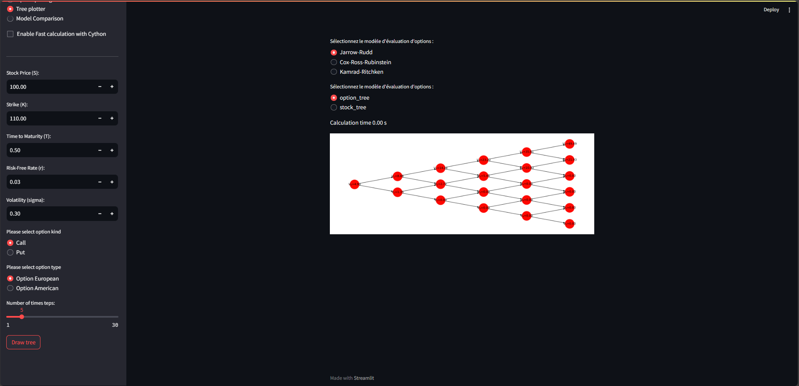
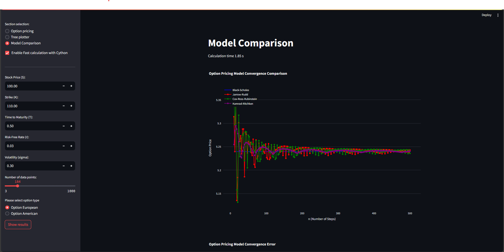
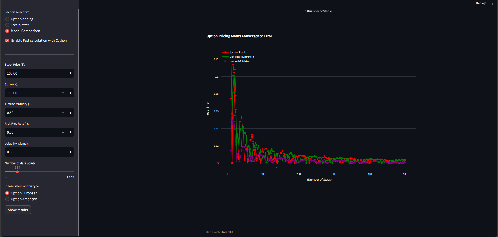

# Option Pricing Web Application


This is a Streamlit web application for option pricing using various models. It provides features for option pricing, tree plotting, and model comparison.

## Table of Contents

- [Option Pricing Web Application](#option-pricing-web-application)
  - [Table of Contents](#table-of-contents)
  - [Description](#description)
  - [How to Run](#how-to-run)
  - [Dependencies](#dependencies)
  - [Usage](#usage)
  - [Screenshots](#screenshots)

## Description

This application provides a user-friendly interface to perform option pricing using different models. It includes the following functionalities:

- **Option Pricing**: Calculate option prices using Black-Scholes, Jarrow-Rudd, Cox-Ross-Rubinstein, and Kamrad-Ritchken models.

- **Tree Plotter**: Visualize option and stock trees for selected models.

- **Model Comparison**: Compare the convergence of different pricing models.

## How to Run

1. Install the required dependencies using the following command:

   ```
   pip install streamlit tree_pricing_drawings matplotlib networkx plotly scipy
   ```

2. Run the application using the following command:

   ```
   streamlit run streamlit_platform.py
   ```

3. The application will open in your default web browser. You can select the desired option from the sidebar and input the required parameters.

## Dependencies

- streamlit
- scipy
- tree_pricing_drawings
- matplotlib
- networkx
- plotly

## Usage

- Select the option from the sidebar (Option Pricing, Tree plotter, Model Comparison).
- Input the required parameters.
- Click the "Calculate Option Price" or "Draw Tree" button as applicable.

## Screenshots







